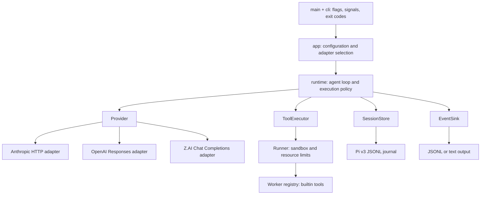

# Extensible core

Danso separates the agent loop from its adapters. A new provider, builtin tool,
output format or storage implementation should not require editing the loop.
This is a single Rust crate with compile-time extension points; dynamic plugin
loading, a plugin ABI and additional production tools are not part of v0.



## Module responsibilities

| Module | Owns | Does not own |
| --- | --- | --- |
| `main.rs`, `cli.rs` | CLI parsing, signal cancellation, run wall timeout, process exits | Agent policy or provider requests |
| `app.rs` | Validating configuration, resolving paths/env, choosing real adapters | Model response conversion or tool dispatch |
| `contracts.rs` | Tool definitions/calls/results, operation states, storage/executor/output interfaces | HTTP formats, clap, subprocesses |
| `compaction.rs` | Bounded text-only checkpoint summarization and schema validation | Journal writes or tool execution |
| `runtime.rs` | History, turn budget, duplicate-call gate, durable operation order | Environment lookup, HTTP, shell spawning, output formatting |
| `provider/` | Provider validation, request/response translation, bounded transport | Tool execution or session mutations |
| `tools/mod.rs` | One registry for definitions and worker dispatch | Agent-loop policy |
| `tools/{read,bash,edit,write}.rs` | Each builtin's definition and implementation | Provider selection or session writes |
| `tools/files.rs` | Shared file-write rules | Registry or runtime selection |
| `tools/runner.rs` | Worker isolation, environment clearing, resource/time/output limits | Tool implementation details |
| `session.rs` | Pi v3 persistence, locking, linear history, recovery validation | Provider I/O or replaying effects |
| `context.rs` | Trust-aware discovery and context budgets | Model requests or tool execution |
| `usage.rs`, `output.rs` | Normalized usage, event rendering, usage prefixes | Authorization or execution policy |

The existing Pi message envelope remains the shared message representation
(`serde_json::Value`) so unknown interchange fields survive persistence. New
tool calls, tool definitions, tool results and operation states have named Rust
types. Provider-specific field names stay inside the provider adapter. The
interfaces are a source-level contract, not a frozen external library ABI.

## Adding a provider

1. Add `src/provider/<name>.rs` and implement `Provider`.
2. Validate supported history in `validate_history`; translate `ModelRequest`
   and return a validated, terminal Pi-compatible assistant message in `complete`.
3. Implement `request_bytes` using the exact body builder also used by `complete`.
   Enforce request/response/time limits, protect credentials, and mark
   `Usage.attempted` only after local validation, immediately before dispatch.
   Add normalized `TokenUsage` using your provider/model name and propagate
   `Usage::add` errors (`?`) so untrusted counters cannot overflow telemetry.
4. Select the adapter in `app.rs` and add CLI/config selection if needed. Keep
   provider branching out of `runtime.rs`.
5. Add wire-format tests with a local fake server. A live canary is a separate
   operator action, never part of the default test suite.

The async traits use static dispatch. A future routing/failover adapter can
implement `Provider` and own multiple concrete providers while retaining the
same runtime contract. Retry semantics, streaming and provider errors require
their own design and tests; this refactor does not claim those features exist.

## Adding a builtin tool

1. Add `src/tools/<name>.rs`; implement `Tool::definition` and `Tool::execute`.
   Keep the JSON parameter schema beside its handler.
2. Register it once in `tools::builtins()`. Both the parent-advertised tool list
   and child-worker dispatch read that registry; duplicate names are rejected.
3. Test schema/behavior and the actual sandbox path. If enabling a fifth tool,
   update the explicit v0 surface acceptance and document the scope change.

`Tool::execute` runs inside the selected worker boundary. Do not call it directly
from the production loop. Registering a tool does not grant extra filesystem,
network, credential or process access. Any expanded capability needs an explicit
change to the executor policy and isolation tests. Tests can use a private
registry without enabling extra production tools.

## Adding output or storage

- Implement `EventSink` to consume session/message/final-answer events. Events
  are notifications, not approval callbacks. Keep machine-readable usage and
  process exit handling in the outer application.
- Implement `SessionStore` to change persistence. Preserve Pi interchange and
  the recovery contract: durable append before returning, exclusive writer,
  strict unresolved-operation detection, and no automatic replay. Stores enabling
  compaction must implement `supports_compaction`, `record_compaction` and
  `tool_call_ids` from the entire original journal, not just active context.
- Implement `ToolExecutor` to add another isolation backend. Preflight must
  fail before provider dispatch when isolation is unavailable. Cancellation
  must contain descendants, and execution must retain resource limits.

## Invariants every extension must preserve

The loop checks recovery and executor preflight before calling a provider.
For each returned batch it validates all call IDs before any side effect.
For each tool it persists `started`, executes, persists the result, then
persists `settled`. A failed journal write prevents execution. Completed
history is context, never a replay queue. Cancellation can leave an unresolved
operation and must not be turned into an implicit success or manual ACK.

Limits belong at their enforcement boundary: discovered context in `context`,
prompt/context/turn limits in `runtime`, serialized provider bytes in the
provider, worker resources in the executor, and whole-run cancellation in the
process supervisor. Embedders calling `runtime::run` supply their own whole-run
timeout and cancellation supervisor; they must not assume CLI signal handling.

## Executable example and regression gates

[`tests/extensibility.rs`](../tests/extensibility.rs) supplies a new scripted
provider, a private `probe` tool, a test executor, a recording output sink and
a failing journal adapter, without changing production runtime code. Tests
prove substitution works and that preflight failure, uncertain recovery,
journal failure and duplicate call IDs cannot cause repeated side effects.

Run the full existing gates after changing a contract:

```sh
cargo fmt --check
cargo clippy --locked --all-targets -- -D warnings
cargo test --locked
cargo build --locked
python3 scripts/test_e2e.py
python3 scripts/test_compaction.py
python3 scripts/test_providers.py
python3 scripts/test_live_acceptance.py
python3 scripts/test_dev_check.py
```

The real-bubblewrap E2E suite continues to cover CLI behavior and the actual
Anthropic wire adapter. The Piri fixture test covers interchange. Adapter tests
complement these tests; they do not replace isolation or protocol evidence.

## Development check environments

Use `python3 scripts/dev_check.py --profile worker` inside the coding worker. It
runs the Python safety and mocked failure-report tests, without Cargo, network
listeners or nested bubblewrap. Its PASS explicitly covers only this subset.

Use `python3 scripts/dev_check.py --profile host` on a development host with
Cargo/rustfmt/clippy and functioning bubblewrap. This runs all required checks
and stops on the first failure, with no automatic fallback to worker mode. The
worker profile does not install or expose a Rust toolchain, and cannot validate
Rust changes or replace integration gates. Root/system mount boundaries and
network isolation remain unchanged. A real-sandbox regression verifies that the
worker profile can run where the previous nested integration attempt failed.
