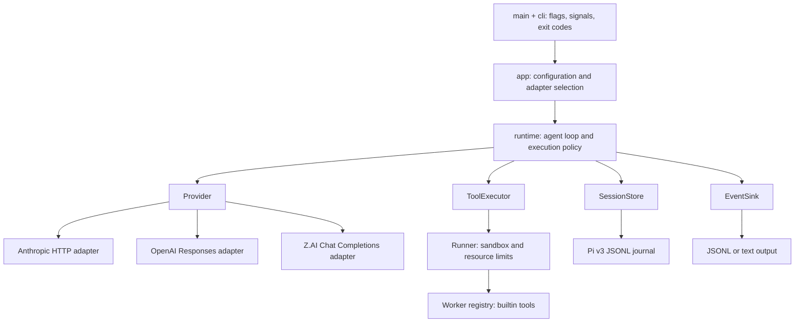

# Extensible core

Danso separates the agent loop from its adapters. A new provider, builtin tool,
output format or storage implementation should not require editing the loop.
This is a single Rust crate with compile-time extension points; dynamic plugin
loading, a plugin ABI and additional production tools are not part of v0.



## Module responsibilities

| Module | Owns | Does not own |
| --- | --- | --- |
| `main.rs`, `cli.rs` | CLI parsing, signal cancellation, run wall timeout, process exits | Agent policy or provider requests |
| `app.rs` | Validating configuration, resolving paths/env, choosing real adapters | Model response conversion or tool dispatch |
| `contracts.rs` | Tool definitions/calls/results, operation states, storage/executor/output interfaces | HTTP formats, clap, subprocesses |
| `compaction.rs` | Bounded text-only checkpoint summarization and schema validation | Journal writes or tool execution |
| `runtime.rs` | History, turn budget, duplicate-call gate, durable operation order | Environment lookup, HTTP, shell spawning, output formatting |
| `provider/` | Provider validation, request/response translation, bounded transport | Tool execution or session mutations |
| `tools/mod.rs` | One registry for definitions and worker dispatch | Agent-loop policy |
| `tools/{read,bash,edit,write}.rs` | Each builtin's definition and implementation | Provider selection or session writes |
| `tools/files.rs` | Shared file-write rules | Registry or runtime selection |
| `tools/runner.rs` | Worker isolation, environment clearing, resource/time/output limits | Tool implementation details |
| `session.rs` | Pi v3 persistence, locking, linear history, recovery validation | Provider I/O or replaying effects |
| `context.rs` | Trust-aware discovery, execution context and context budgets | Model requests or tool execution |
| `failure.rs` | Typed failure categories and body-free CLI error records | Inferring causes from provider text or authorizing retries |
| `usage.rs`, `output.rs` | Normalized usage, event rendering, usage prefixes | Authorization or execution policy |

The existing Pi message envelope remains the shared message representation
(`serde_json::Value`) so unknown interchange fields survive persistence. New
tool calls, tool definitions, tool results and operation states have named Rust
types. Provider-specific field names stay inside the provider adapter. The
interfaces are a source-level contract, not a frozen external library ABI.

## Adding a provider

1. Add `src/provider/<name>.rs` and implement `Provider`.
2. Validate supported history in `validate_history`; translate `ModelRequest`
   and return a validated, terminal Pi-compatible assistant message in `complete`.
3. Implement `request_bytes` using the exact body builder also used by `complete`.
   Enforce request/response/time limits, protect credentials, and mark
   `Usage.attempted` only after local validation, immediately before dispatch.
   Add normalized `TokenUsage` using your provider/model name and propagate
   `Usage::add` errors (`?`) so untrusted counters cannot overflow telemetry.
4. Select the adapter in `app.rs` and add CLI/config selection if needed. Keep
   provider branching out of `runtime.rs`.
5. Add wire-format tests with a local fake server. A live canary is a separate
   operator action, never part of the default test suite.

The async traits use static dispatch. A future routing/failover adapter can
implement `Provider` and own multiple concrete providers while retaining the
same runtime contract. Retry semantics, streaming and provider errors require
their own design and tests; this refactor does not claim those features exist.

## Adding a builtin tool

1. Add `src/tools/<name>.rs`; implement `Tool::definition` and `Tool::execute`.
   Keep the JSON parameter schema beside its handler.
2. Register it once in `tools::builtins()`. Both the parent-advertised tool list
   and child-worker dispatch read that registry; duplicate names are rejected.
3. Test schema/behavior and the actual sandbox path. If enabling a fifth tool,
   update the explicit v0 surface acceptance and document the scope change.

`Tool::execute` runs inside the selected worker boundary. Do not call it directly
from the production loop. Registering a tool does not grant extra filesystem,
network, credential or process access. Any expanded capability needs an explicit
change to the executor policy and isolation tests. Tests can use a private
registry without enabling extra production tools.

## Adding output or storage

- Implement `EventSink` to consume session/message/final-answer events. Events
  are notifications, not approval callbacks. Keep machine-readable usage and
  process exit handling in the outer application.
- Implement `SessionStore` to change persistence. Preserve Pi interchange and
  the recovery contract: durable append before returning, exclusive writer,
  strict unresolved-operation detection, and no automatic replay. Stores enabling
  compaction must implement `supports_compaction`, `record_compaction` and
  `tool_call_ids` from the entire original journal, not just active context.
- Implement `ToolExecutor` to add another isolation backend. Preflight must
  fail before provider dispatch when isolation is unavailable. Cancellation
  must contain descendants, and execution must retain resource limits.

## Invariants every extension must preserve

The loop checks recovery and executor preflight before calling a provider.
For each returned batch it validates all call IDs before any side effect.
For each tool it persists `started`, executes, persists the result, then
persists `settled`. A failed journal write prevents execution. Completed
history is context, never a replay queue. Cancellation can leave an unresolved
operation and must not be turned into an implicit success or manual ACK.

Limits belong at their enforcement boundary: discovered context in `context`,
prompt/context/turn limits in `runtime`, serialized provider bytes in the
provider, worker resources in the executor, and whole-run cancellation in the
process supervisor. Embedders calling `runtime::run` supply their own whole-run
timeout and cancellation supervisor; they must not assume CLI signal handling.

## Worker request-budget guidance

Every action request receives run-local system guidance with `remaining` (including
that request), `total`, and `summary_requests`. Checkpoint fragments and their
repair attempts consume the same `max_turns` allowance. After compaction the
runtime recomputes the guidance before checking the exact serialized request
size. It does not reserve extra requests or relax the existing exhaustion gate.

The guidance asks the worker to prioritize unfinished edits, required checks and
an accurate final report, and to leave a request for inspecting tool results.
With one request left, a tool response cannot receive a follow-up model response.
This is advisory: it neither proves task completion nor authorizes skipping
validation. Token and time limits are separate. Guidance is not journaled or
summarized; a resumed run starts with its own fresh budget. Offline tests verify
accounting and provider transport; improved live task completion is unproven.

## Executable example and regression gates

[`tests/extensibility.rs`](../tests/extensibility.rs) supplies a new scripted
provider, a private `probe` tool, a test executor, a recording output sink and
a failing journal adapter, without changing production runtime code. Tests
prove substitution works and that preflight failure, uncertain recovery,
journal failure and duplicate call IDs cannot cause repeated side effects.

Run the full existing gates after changing a contract:

```sh
cargo fmt --check
cargo clippy --locked --all-targets -- -D warnings
cargo test --locked
cargo build --locked
python3 scripts/test_e2e.py
python3 scripts/test_compaction.py
python3 scripts/test_providers.py
python3 scripts/test_live_acceptance.py
python3 scripts/test_dev_check.py
python3 scripts/test_worker_checks.py
python3 scripts/test_dev_check_host.py
python3 scripts/test_ccc_node.py
```

The real-bubblewrap E2E suite continues to cover CLI behavior and the actual
Anthropic wire adapter. The Piri fixture test covers interchange. Adapter tests
complement these tests; they do not replace isolation or protocol evidence.

## Development check environments

Use `python3 scripts/dev_check.py --profile worker` inside the coding worker. It
runs the Python safety, mocked failure-report and development-profile unit tests, without Cargo, network
listeners or nested bubblewrap. Its PASS explicitly covers only this subset.

Use `python3 scripts/dev_check.py --profile host` on a development host with
Cargo/rustfmt/clippy and functioning bubblewrap. This runs all required checks
and stops on the first failure, with no automatic fallback to worker mode. The
worker profile does not install or expose a Rust toolchain, and cannot validate
Rust changes or replace integration gates. Root/system mount boundaries and
network isolation remain unchanged. A real-sandbox regression verifies that the
worker profile can run where the previous nested integration attempt failed.

#### Listing planned commands (`--list`)

`--list` prints exactly one JSON object to stdout with the shape
`{"profile":str,"executed":false,"commands":[{"argv":[str,...],"cwd":str},...]}`
and exits 0 without running any check or subprocess. The `argv` lists come from
the same `commands(profile)` source used for execution, in the existing order;
`cwd` is the repository root for the host profile and the `scripts/` directory
for the worker profile, matching where each command runs. Listing does not
validate a host toolchain or sandbox and does not replace the full host gates;
it only reports what a full run would attempt.

```sh
python3 scripts/dev_check.py --profile worker --list
```

```sh
python3 scripts/dev_check.py --profile host --list
```

`--list` and `--json` are mutually exclusive for either profile; combining them
exits 2 with no stdout. Without `--list`, behavior and return codes are
unchanged.

The opt-in [ccc-node auxiliary worker](ccc-node-worker.md) owns subprocess
supervision and native ccc-node event mapping outside the Rust agent loop.

`python3 -m unittest test_dev_check -v` (from `scripts/`) runs worker-safe
unit tests only. The real-sandbox case lives in `test_dev_check_host.py`, which
both the host profile and CI execute explicitly. Broad unittest discovery still
includes host-only modules; it is not a worker check.

`test_dev_check.OutputContract` checks the wrapper's existing non-`--list`
behavior with synthetic child checks. Plain worker/host modes preserve their
stdout banner and final PASS line; worker `--json` adds neither stdout nor stderr
on success. Child stdout and stderr stay on their original streams. A nonzero
child exit or start failure returns 1, emits the fixed stderr diagnostic without
raw exception text, and stops the remaining checks, including after a prior
check succeeded. Host `--json` rejects with exit 2 and no stdout or check effects.
The contract is part of both development profiles and CI, and can run alone:

```sh
cd scripts && python3 -m unittest test_dev_check.OutputContract -v
```

These tests do not execute a real child process or assess generated-test coverage,
documentation quality, or model efficiency. Do not infer whole-task acceptance
from their PASS or alter a measured candidate to make it pass.

Bash tools start with `pipefail`: `failing_check | tail` returns a failure even
when `tail` succeeds. This preserves pipeline failure status without enabling
`errexit` or stopping later commands. `failing_check; echo done`, explicit
`|| true`, or disabling pipefail can still return success. It is not an execution
allowlist or test-result parser. A successful tool exit does not prove all checks
passed; inspect their results and distinguish attempted, passed, failed, and
omitted checks in reports. Early-closing consumers such as `head` can cause a
producer's SIGPIPE to make the pipeline fail; prefer bounded reads at the source.

### Worker check receipts and count comparison

`dev_check.py --profile worker` runs each configured unittest selector once and
emits a `DANSO_CHECK_RESULTS=` JSON line before the wrapper's PASS/FAIL outcome.
Each suite row identifies its selector and actual `tests_run`, `failure_events`,
`error_events`, `skipped`, `expected_failures`, `unexpected_successes`, and
`successful`. Top-level `tests_run` is the sum across this invocation's suites,
not the count for any one module. Subtest failures and class-setup errors are
**events**, not distinct failed tests; do not subtract them to invent a passed
count. A zero-test suite is unsuccessful. Skips and expected failures retain
unittest semantics and remain visible. Import failures produce error results;
exceptions raised directly during loading record zero runs and one error event.

Save a plain JSON receipt (test output and diagnostics go to stderr):

```sh
python3 scripts/dev_check.py --profile worker --json > worker-results.json
```

This option is worker-only; it does not claim Rust or host-gate test totals.
The runner still exits nonzero on unsuccessful tests. If execution is interrupted
or receipt emission fails, no complete receipt can be assumed.

Compare reported per-selector counts against a saved receipt without running
checks again. For example, this claim intentionally assigns the combined total
to a unit module; replace the illustrative counts with the report being audited:

```sh
python3 scripts/worker_checks.py --compare-counts \
  '{"test_live_acceptance.Safety":5,"test_live_acceptance.FailureReporting":8,"test_dev_check":19,"test_worker_checks":8}' \
  < worker-results.json
```

Comparison requires every selector exactly once, rejects malformed or
inconsistent receipts, and returns JSON differences. Exit 0 means counts match
**and** the recorded checks were successful; exit 1 means a count mismatch or
recorded failure; exit 2 means invalid input. It compares structured count claims,
not arbitrary model prose, and does not authenticate an edited receipt or rerun
old tests. Retain the receipt with its run evidence. Cross-run totals and repeated
checks are not deduplicated automatically. The configured worker selectors are
disjoint; callers extending them must keep that property.

#### Partial count comparison (`--compare-partial-counts`)

When a report claims only a subset of the receipt's selectors, use
`--compare-partial-counts`. Claims must be a nonempty JSON object whose keys are
selectors present in the receipt with nonnegative integer counts (booleans are
rejected). Like `--compare-counts`, it reads the same bounded plain receipt JSON
from stdin, never runs tests, and is mutually exclusive with `--json`,
`--compare-counts`, and positional test selectors. Invalid claims, unknown or
duplicate keys, or an invalid receipt exit 2 with no stdout JSON. Example
(adjust the counts to the report being audited):

```sh
python3 scripts/worker_checks.py --compare-partial-counts \
  '{"test_live_acceptance.Safety":5,"test_dev_check":4}' \
  < worker-results.json
```

The result JSON has the exact shape
`{"version":1,"counts_match":bool,"checks_successful":bool,"differences":[{"selector":str,"reported":int,"actual":int},...],"unreported_selectors":[str,...]}`.
`differences` includes only claimed mismatches; both `differences` and
`unreported_selectors` follow receipt suite order. Exit 0 requires **both** that
every supplied count matches **and** that the entire receipt is successful; a
failed suite that was not reported still forces exit 1. Note that
`counts_match: true` only describes the supplied claims — it does **not** mean
all selectors were reported; check `unreported_selectors` before treating a run
as fully accounted for. The same limits apply as for strict comparison: this is
a structured-count check, not receipt authentication or arbitrary prose
parsing; retain the receipt with its run evidence.

#### Extract original receipts from a journal

```sh
python3 scripts/worker_checks.py --extract-receipts < session.jsonl > receipts.json
```

This read-only mode accepts up to 16 MiB of UTF-8 JSONL on stdin. It never opens
journal paths, modifies a session, runs tests or resumes tools. It extracts only
complete `DANSO_CHECK_RESULTS=` lines from text blocks in original `message`
entries with role `toolResult`; user/assistant text and custom checkpoints are
ignored. Plain unmarked JSON output is not treated as a receipt.

Output is `{"version":1,"receipts":[...]}`. Each row contains `entry_id`,
`tool_call_id`, a 1-based `receipt_index` within that tool result, `tool_is_error`
and the validated `receipt`. All markers are retained in journal/block/line
order, including multiple checks in one shell call and failed checks. No latest
run is chosen, no cross-run total is calculated, and no repeated run is removed.
Tool status is independent of receipt status: a shell command can mask a failed
check, so auditing must inspect `receipt.successful` too.

Exit 0 means receipts were extracted, **not** that checks passed; exit 1 returns
an empty receipts list when none were found. Invalid JSON/UTF-8, duplicate JSON
keys or tool-result identities, malformed marked receipts, missing marked-result
status, and oversized input exit 2 without partial stdout. Non-finite JSON
numbers are rejected by all receipt parsing modes.

Select a specific row using its IDs and index, then pass only its `receipt` to
`--compare-counts` or `--compare-partial-counts`. For example, with `jq` installed,
this selects the first receipt of an explicitly chosen call and rejects zero or
multiple matches before extracting it:

```sh
jq -e '[.receipts[] | select(.tool_call_id == "CALL_ID" and .receipt_index == 1)] |
  if length == 1 then .[0].receipt else error("ambiguous or absent receipt") end' \
  receipts.json > selected-receipt.json
python3 scripts/worker_checks.py --compare-partial-counts \
  '{"test_dev_check":4}' < selected-receipt.json
```

Extraction is an offline evidence aid, not journal chain/operation validation,
receipt authentication, or permission to resume. A tool can print fabricated
markers and an edited journal can contain fabricated results. Keep the original
run evidence; normal runtime recovery remains the authority for resuming a
session. Bounded checkpoint excerpts cannot replace the original receipt.
