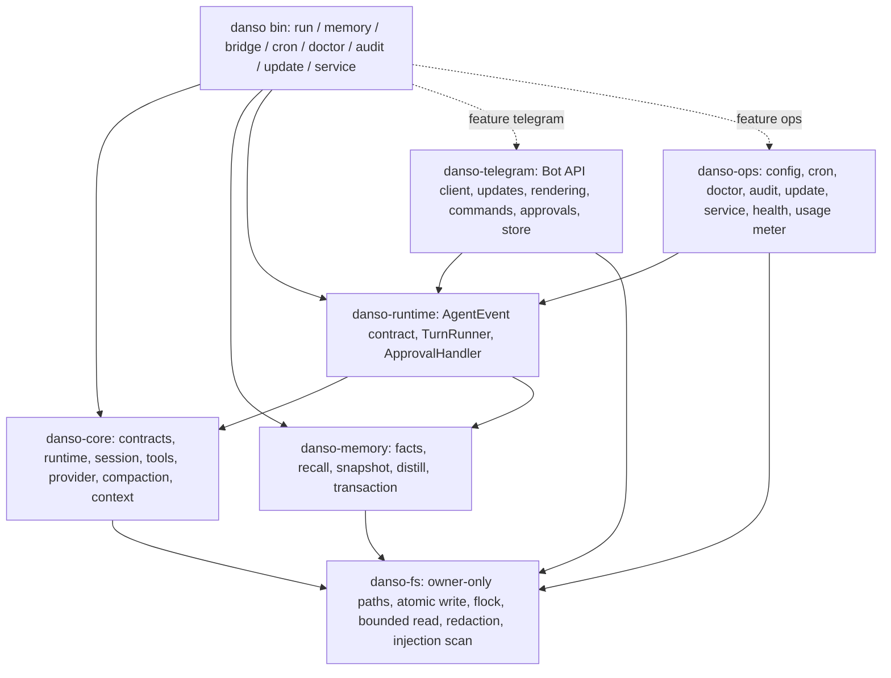

# Danso 단일 레포 통합 설계 (ccc-node 기능의 Rust 재구현)

상위 로드맵: [issue #33](https://github.com/jinwon-int/danso/issues/33).
이 문서는 #33 표의 3행(Telegram)·4행(서비스 모드·설정·진단·백업·업데이트)·
후속 행과, 아직 표에 없는 ccc-node 기능(agent-cron, 스킬 파이프라인, A2A,
음성 등)의 **소유권·범위·모듈 경계·단계**를 확정하기 위한 설계안이다.
1행(메모리)과 2행(distill 큐)은 main에 반영돼 있으므로(#38, #52, #87) 여기서는
그 결과를 전제로만 다룬다.

조사 기준: `jinwon-int/ccc-node` `6ef145e`, `jinwon-int/piri` main,
`jinwon-int/danso` `3a4ac3e`. 이 문서는 설계이며 구현 완료 선언이 아니다.

## 1. 결정 사항과 원칙

- **런타임은 하나다.** piri+ccc-node, codex+ccc-node 조합을 danso 단일 바이너리로
  대체한다. Piri(TypeScript Pi)와 Codex app-server는 실행 런타임에서 제외한다.
  Codex 구독은 이미 danso의 `openai-codex` 제공자(ChatGPT auth 파일)가 담당한다.
- **새 운영 코드는 Rust로 작성한다.** #33 지시대로 Python/Shell 구현을 런타임에
  묶거나 호출하는 방식은 완료로 치지 않는다. 사용자가 도구로 실행하는
  Python/Node(예: 작업 대상 프로젝트)와 테스트·평가 스크립트는 예외다.
- **CLI 전용 설치에는 채널·운영 의존성이 추가되지 않는다.** Telegram, 스케줄러,
  서비스 관리는 Cargo feature/workspace 크레이트로 분리한다.
- **ccc-node가 검증한 불변조건을 계약으로 옮긴다.** fail-closed 기본, 본문 없는
  관측 기록, 저널 선기록 후 전달, 단일 작성자, 원본 보존·무재생. 코드 줄 번역이
  아니라 사용자에게 보장하던 동작의 보존이 기준이다.
- **한 봇 토큰의 소비자는 하나다.** 전환 기간에 ccc-node 브리지와 danso 브리지가
  같은 토큰을 동시에 폴링하지 못하게 토큰 잠금을 첫 슬라이스에 넣는다.

## 2. 기능 매핑표 (ccc-node → danso)

분류: **코어**(항상 포함), **선택 모듈**(feature), **후속**(별도 이슈 뒤 편입),
**편입 안 함**(폐기 또는 다른 레포에 남김).

| ccc-node 영역 | 원본 위치 | danso 결정 | 비고 |
| --- | --- | --- | --- |
| 에이전트 루프·도구·저널·압축·장기과제 | (danso 자체) | 코어 (기존) | 변경 없음. 인프로세스 호출용 취소 안전성만 추가(§4.2) |
| 로컬 메모리·검색·주입·distill 큐 | `bridge/memory/*`, `claude/hooks/load-memory.sh` | 코어 (기존, #52/#87) | 잔여: `--memory-legacy-read`, `memory_requests`(#86) |
| 청중(audience) 스코프 라우팅 | `bridge/core/memory_audience.py`, `memory_policy.py` | 선택 모듈 `telegram` | HMAC 키 → `private-<32hex>`; danso 메모리 스코프 형식과 이미 일치 |
| `AgentRuntime`/`AgentSession` 이벤트 계약 | `bridge/core/agent_runtime.py` | 코어 (`danso-runtime` 크레이트에 Rust 타입으로) | §4.1 |
| Telegram 송수신·접근 제어·세션 연결·진행·취소·명령 | `bridge/core/bot*.py`, `streaming.py`, `ui.py`, `utils/tg_*` | 선택 모듈 `telegram` (#33 3행) | §5 |
| 승인(approval) 흐름 | `bot_approvals.py`, `approval_contract.py`, `approval_audit.py` | 선택 모듈 `telegram` + 코어 `ToolExecutor::admit` 훅 | 훅은 A단계에 추가됨; `Ask` 경로는 B4(§4.3) |
| 하트비트·상태 메시지·정체 감지 | `heartbeat.py`, `turn_watchdog.py`, `turn_stall.py` | 선택 모듈 `telegram` | 감지만, 개입 없음 원칙 유지 |
| 후속 메시지 큐, `/stop` 우선 | `bot_followup_queue.py`, `task_queue.py` | 선택 모듈 `telegram` | 내구 큐 + 상한 |
| 세션 저장소(`sessions.json`) | `session/store.py`, `manager.py` | 선택 모듈 `telegram` | atomic + `.bak` + CAS 패턴 그대로 |
| 푸시 스풀(파일 기반 알림) | `push_notifier.py` | 선택 모듈 `telegram` | 스풀 형식 유지: cron·훅이 토큰 없이 알림 가능 |
| 파일 송수신(문서·사진) | `bot_delivery.py`, `media.py` | 선택 모듈 `telegram` | 워크스페이스 안은 자동, 밖은 확인 버튼 |
| 음성(Whisper/TTS/TOS) | `bot_voice.py`, `utils/transcription.py` | 후속 feature `voice` | ffmpeg 외부 의존, Whisper는 HTTP만. 운영자 결정 필요 |
| 인바운드 rich text 정규화 | `telegram_rich_text.py` | 선택 모듈 `telegram` | 노드/깊이/바이트 상한 그대로 |
| 사용량 미터·예산 | `usage.py`, `usage_meter.py`, `usage_cost_ledger.py` | 선택 모듈 `ops` | 자율 실행만 차단, 대화 턴은 기록만 |
| 수명주기 관측 원장 | `lifecycle_*.py` | 선택 모듈 `ops` | 본문 없는 관측, fail-open |
| 서비스 모드·재시작 핸드오프·crash policy | `start.sh`, `service-systemd.sh`, `restart_handoff.py`, `crash_policy.py` | 선택 모듈 `ops` (#33 4행) | §6.4 |
| 설정(`config.py` 149키) | `bridge/utils/config.py` | 코어 `config` | §6.1, TOML + env |
| 보안 파일 계층·redaction | `utils/secure_fs.py`, `redaction.py` | 코어 `danso-fs` | 기존 `memory/paths.rs`를 승격 |
| doctor·security-audit | `scripts/ccc_doctor.py`, `ccc-security-audit.sh` | 선택 모듈 `ops` | §6.2 |
| self-update(서명 검증) | `scripts/ccc-self-update.sh` | 선택 모듈 `ops` | 바이너리 배포에 맞춰 gpg→ed25519(§6.3) |
| agent-cron(예약 실행) | `scripts/agent_cron*.py`, schema v1 | 선택 모듈 `ops` | §6.5. #87(a)의 외부 트리거를 대체할 내장 스케줄러 |
| 백업·복구 | `ccc-live-backups-rotate.sh` 등 | 선택 모듈 `ops` | §6.6 |
| 스킬 인덱스 주입 블록 | `load-memory.sh` `## Node skills index` | 코어 메모리 스냅샷에 소량 추가 | 기존 스킬 디스커버리(`context.rs`)가 이름·설명을 이미 안다 |
| nunchi(피어 사실 저장소·judge·wiki-promote) | `claude/hooks/nunchi/*` | 후속 | 쓰기 게이트는 `facts.rs`와 동일. 별도 저장소 대신 `subject=peer` 확장으로 검토 |
| Family Wiki 캐시·prefetch·후보 소비 | `refresh-memory.sh`, `wiki-agent` | 후속 (명시적 네트워크 계약) | 후보 큐는 이미 있음. 소비자만 없음 |
| 임베딩 검색 레인 | `CCC_MEMORY_EMBED_CMD` | 후속 선택 | SQLite 없음 원칙 유지 |
| 스킬 autosave·후보·승격·졸업·큐레이터 | `skill-review/*`, `skill_candidate*.py`, `ccc-skill-promotion.py` | 후속 | fleet-skills 레포와 A2A 리뷰에 결합돼 있음 |
| 외부 CI 대기·continuation·webhook nudge | `external_wait*.py`, `continuation*.py`, `webhook_nudge.py` | 후속 | GitHub API 클라이언트 필요 |
| Web MCP(searxng/firecrawl) | `web_mcp.py` | 후속 | danso는 MCP·5번째 도구 없음 |
| `/revert`·`/history` 전사 브라우징 | `revert.py`, `project_chat_history.py` | `/history`는 선택 모듈, `/revert`는 후속 | 저널 잘라내기는 무재생 원칙과 충돌 → 새 세션으로 대체 검토 |
| Claude Agent SDK 런타임 | `claude_runtime.py` 외 8 믹스인 | 편입 안 함 | Anthropic은 API 키 제공자로만. 구독 Claude Code가 필요하면 #33 표에 "외부 런타임 어댑터" 행을 추가한 뒤 진행 |
| Codex app-server, Piri RPC, Crush, Grok 런타임 | `codex_*`, `piri_*`, `crush_runtime.py`, `grok_*` | 편입 안 함 | 단일 런타임 결정. 이력은 보존만(§7) |
| Codex/Piri 메모리 materializer·런처 | `scripts/ccc-codex`, `ccc-piri`, `ccc_codex_memory.py` | 편입 안 함 | 대상 런타임이 없어짐 |
| A2A 워커 레인·Termux 네이티브 워커 | `scripts/a2a-*` | 편입 안 함 | a2a-nexus 소유. danso를 워커 핸들러로 쓰는 것은 별도 이슈 |
| auto-distill(30분 canary, `AUTO.md`) | `scripts/auto-distill/*` | 편입 안 함 | danso distill 큐가 대체 |
| Claude Code 하네스 설정·훅·output-style | `claude/`, `setup.sh` 대부분 | 편입 안 함 | 대화형 Claude Code용. ccc-node 잔여 역할(#33 4단계) |
| architecture/side-effect 계약 검사 | `architecture/*.json`, `scripts/ccc_*_contract.py` | 코어 CI (Rust 버전) | §8 |

## 3. 목표 구조



### 3.1 Cargo workspace

| 크레이트 | 내용 | 새 외부 의존성 |
| --- | --- | --- |
| `danso-fs` | `memory/paths.rs`의 owner-only 검증·`open_secure`·atomic write·flock·bounded read를 승격, `redaction`(자격증명 패턴), `scan`(주입 스캐너) | 없음 (`libc`, `sha2` 기존) |
| `danso-core` | 현재 `src/` 중 memory 제외 전부 | 없음 |
| `danso-memory` | 현재 `src/memory/*` | 없음 |
| `danso-runtime` | `AgentEvent`, `AgentSession`, `TurnRunner`(인프로세스/서브프로세스), `ApprovalHandler` | 없음 |
| `danso-telegram` | Bot API 클라이언트, 업데이트 루프, 렌더러, 명령, 승인, 대화 저장소, 하트비트, 스풀 | `reqwest` `multipart` feature (파일 전송) |
| `danso-ops` | 설정, cron 스케줄러, doctor, audit, update, service, health, 사용량 미터 | `toml`, `ed25519-dalek`(업데이트 서명), `hmac` |
| `danso` (bin) | 서브커맨드 조합. `default-features = ["ops"]`, `telegram`은 opt-in | — |

현재 단일 크레이트에서 분리하는 시점은 **3행 첫 PR 직전**(§9 A단계)이다.
그 전 메모리 잔여 작업(#86, #87)은 기존 구조에서 진행한다. 분리 PR은
동작 변경 없이 파일 이동만 하고, 기존 통합 테스트(`scripts/test_*.py`)가
그대로 통과해야 한다.

### 3.2 의존성 정책

- 허용: `toml`, `hmac`, `ed25519-dalek`(또는 `ring`의 ed25519), `reqwest/multipart`.
- 금지: `teloxide`(의존성 트리 과대, 폴링/재시도 정책을 우리가 소유해야 함),
  `tokio-cron-scheduler`(ccc 방언과 다름), SQLite 바인딩(메모리 v1 원칙),
  Python/Node 서브프로세스에 의존하는 어댑터.
- cron 파서는 ccc `agent_cron_lib.py`의 제한된 방언(5필드 숫자, `@daily` 별칭,
  `every N`, `at ISO`)만 직접 구현한다. 기존 Python 테스트 케이스를 Rust로 이식해
  동일 결과를 검증한다.
- Telegram Bot API 클라이언트는 필요한 메서드만 직접 구현한다(§5.1).
- 모든 새 의존성은 `Cargo.lock` 고정과 `cargo audit` CI(기존 `audit.yml`)를 거친다.

## 4. 공통 실행·이벤트 계약 (`danso-runtime`)

### 4.1 `AgentEvent`

ccc-node `agent_runtime.py`의 이벤트 집합을 Rust enum으로 옮긴다. 생성자에서
검증하는 fail-closed 규칙(빈 텍스트 거부, id 비어 있음 거부, 정수 상한)을
`TryFrom`/생성 함수에 둔다.

```rust
pub enum AgentEvent {
    TextDelta { text: String },                 // 비어 있지 않음
    MessageCompleted,
    ReasoningDelta { text: String },            // 사용자에게 절대 전달하지 않음
    ToolStarted { call_id: String, tool: ToolName, arguments: Option<Value> },
    ToolCompleted { call_id: String, tool: ToolName, success: bool, result: Option<Value> },
    ApprovalRequest { request_id: String, action: String, arguments: Value, description: String },
    ApprovalResolved { request_id: String, action: String, decision: ApprovalDecision },
    TaskProgress { state: TaskState, stage: u64, requests: u64, reported_tokens: u64, elapsed_seconds: u64 },
    Completion { stop_reason: String },
    Result { result: Value },
    Error { code: ErrorCode, message: String, retryable: bool },
}
```

- 기본은 **본문 없음**: `arguments`/`result`는 실행기 정책이 표시를 허용한 경우에만
  `Some`이다. Telegram 렌더러는 도구 이름과 성공 여부만 쓰고, 인수·결과·경로는
  쓰지 않는다(ccc의 danso 레인과 동일).
- 기존 `contracts::Event`(Session/Message/Compaction/FinalAnswer/Task/Request/
  ToolStarted/ToolSettled)는 그대로 두고, `danso-runtime`이 `EventSink` 구현체로
  `AgentEvent`로 변환한다. `runtime.rs`는 손대지 않는다.
- `TextDelta`는 현재 제공자가 비스트리밍(HTTP 완료 응답)이므로 최종 답변 한
  덩어리로만 나온다. 토큰 단위 스트리밍은 후속(§10)이며, 계약은 지금 고정한다.
- `ErrorCode`는 `failure.rs`의 카테고리(`configuration`, `session`, `sandbox`,
  `provider`, `provider_timeout`, `compaction`, `request_budget`, `output`,
  `runtime`, `run_timeout`, `interrupted`)에 `cancelled`, `input`,
  `task_resume_unavailable`, `task_paused`를 더한 닫힌 열거형이다. 제공자 응답
  본문·URL·자격증명은 절대 실리지 않는다(`DANSO_PROVIDER`/`DANSO_TRANSPORT`의
  bounded 필드만).

### 4.2 `TurnRunner`

```rust
pub trait TurnRunner {
    async fn start_or_resume(&self, req: SessionRequest) -> Result<Box<dyn AgentSession>>;
    async fn list_models(&self) -> Result<Vec<ModelInfo>>;
}
pub trait AgentSession {
    fn session_id(&self) -> &str;                       // 저널 UUID
    fn send_turn(&self, msg: TurnInput, approvals: Arc<dyn ApprovalHandler>) -> EventStream;
    async fn interrupt(&self);                          // 유휴면 no-op
    async fn request_pause(&self) -> bool;              // 장기과제 settled 경계 일시정지
}
```

두 구현을 둔다.

| 구현 | 용도 | 취소 | 격리 |
| --- | --- | --- | --- |
| `InProcessRunner` | 기본. `app::run`을 라이브러리로 호출, `EventSink`→채널 | `CancellationToken` + `pause_requested: AtomicBool`(이미 존재) | 호스트 백엔드. 런 실패가 브리지 프로세스를 죽이지 않게 panic 격리(`catch_unwind` 대신 태스크 경계 + `JoinError` 처리) |
| `SubprocessRunner` | bubblewrap 격리, 메모리 상한이 필요한 노드, 전환기 호환 | 프로세스 그룹 SIGTERM→SIGKILL | 현재 ccc `danso_worker.py`의 CLI 호출 형태를 그대로 Rust로 옮김 |

`InProcessRunner`가 성립하려면 코어에 두 가지가 필요하다.

1. **취소 안전성.** `run` future가 drop되면 실행 중인 도구의 후손 프로세스를
   supervisor가 정리하고, 저널은 `started`만 남은 상태(불확정)로 남는다. 이는
   현재 SIGTERM 의미와 같다. `runner.rs`/`supervisor.rs`에 drop-guard를 명시하고
   테스트로 증명한다.
2. **`app::run` 진입점 정리.** 환경변수 읽기(`provider_from_parts`)와 경로
   검증을 `RunConfig` 생성 시점으로 옮겨, 브리지가 자격증명을 프로세스 환경에
   넣지 않고 `ProviderCredential` 값으로 주입할 수 있게 한다. CLI는 기존대로
   env에서 채운다.

한 대화당 한 턴(직렬화)은 `AgentSession` 내부 `Mutex`가 아니라 브리지의 대화
큐가 보장한다. 같은 저널 UUID에 대한 교차 프로세스 잠금은 기존 `session.rs`의
flock이 그대로 담당한다.

### 4.3 도구 admission(`ToolExecutor::admit`)과 승인

v0 계약은 "네 도구, 승인 UI 없음"이다. Telegram 그룹·비소유자 경로에서는
ccc-node의 `strict-project`/`owner-operator`/`disabled` 프로필과 bash 정책
(`disabled`/`approve-each`/`auto-approve`)이 필요하다. 코어에는 **정책 훅만**
추가하고 정책 판단은 밖에 둔다. 훅은 별도 트레이트가 아니라 기존
`ToolExecutor`의 기본 메서드다(A단계 구현): 루프는 분기하지 않고, 임베더는
실행기를 감싸 정책을 얹는다.

```rust
pub enum Verdict { Allow, Deny { reason: String }, Ask }
pub trait ToolExecutor {
    fn admit(&self, call: &ToolCall) -> Verdict { Verdict::Allow }   // 기본 = 허용
    // definitions / preflight / execute …
}
// danso-runtime
pub trait ApprovalHandler: Send + Sync {
    fn decide(&self, req: &ApprovalRequest) -> BoxFuture<'_, ApprovalDecision>; // DenyAll 기본
}
```

- 루프는 `started` 저널 기록 **전**에 `admit`을 묻는다. `Deny`/`Ask→Deny`는
  `toolResult.isError=true`로 모델에 돌아가고 저널에는 정상 `started/settled`로
  남으며 실행기는 호출되지 않는다. 즉 승인 거부는 도구 실패다.
- `Ask`는 B4에서 `ApprovalRequest` 이벤트를 내고 `ApprovalHandler`를 기다린다.
  그 전까지, 그리고 핸들러 부재·타임아웃(기본 60초)·예외는 모두 Deny다.
- CLI 기본 정책은 허용(현재 동작 불변). 브리지 기본은
  `owner-operator`(소유자 1인 DM은 Allow, 그 외 `bash`는 Ask, `write/edit`는
  워크스페이스 밖이면 Ask).
- 승인 토큰은 요청 지문(HMAC)과 **렌더링된 텍스트 지문(SHA-256)** 둘 다에
  묶인다. 인수 변경·만료·세대 교체·늦은 응답은 모두 거부. 결정은 본문 없는
  `approval-audit.jsonl`에 남긴다. 세션 전체 Allow-All은 제공하지 않는다.
- 이 훅은 4행 기능이 아니라 3행 후반(§9 B4)에서 도입한다. 그 전까지 브리지는
  현재 ccc danso 레인과 같이 `interactive_approvals: unsupported`로 소유자 DM만
  허용한다.

## 5. Telegram 모듈 (`danso-telegram`, #33 3행)

### 5.1 Bot API 클라이언트

직접 구현하는 메서드: `getUpdates`(long poll, offset, allowed_updates),
`getMe`, `sendMessage`, `editMessageText`, `deleteMessage`, `sendDocument`,
`sendPhoto`, `getFile`+파일 다운로드, `answerCallbackQuery`, `sendChatAction`,
`setMyCommands`(scope별). 응답은 `serde_json::Value`에서 필요한 필드만 뽑는다.

오류 분류를 타입으로 고정한다(ccc `tg_robust.py`, `tg_errors.py`의 교훈).

| 분류 | 처리 |
| --- | --- |
| 429 `retry_after` | 지정 초만큼 대기 후 같은 요청 1회 재시도(상한 60초) |
| 400 "message is not modified" | 성공으로 간주 |
| 400 "message to edit not found" | 초안 상태 폐기, 새 메시지로 |
| 네트워크 timeout (송신 계열) | **재시도하지 않음** (중복 전송 위험). 수신 계열(`getUpdates`)만 재시도 |
| 401/404 (토큰) | 즉시 종료, 설정 오류 |
| 5xx | 지수 백오프 1s/4s/16s, 최대 3회 |

`getUpdates` 루프는 별도 tokio 태스크가 소유하고, 전송 경로와 HTTP 클라이언트를
분리한다(프록시·연결 재수립 시 폴링 복구가 송신에 막히지 않게).

### 5.2 토큰 잠금·접근 제어·스코프

- **토큰 잠금**: `$DANSO_HOME/telegram/<sha256(token)[:16]>.lock`에 flock. 잡혀
  있으면 시작 거부(exit 2). 잠금 inode는 절대 교체하지 않는다(ccc
  `token_lock.py` 교훈). `danso bridge --status`는 보유 PID를 보여준다.
- **접근**: `allowed_user_ids` 필수(빈 목록이면 시작 거부. ccc의
  `CCC_REQUIRE_ALLOWLIST` 기본 참). 20분 넘은 업데이트는 조용히 폐기.
- **세션 스코프**: `per-user-chat`(기본), `shared-groups`. `shared-all`은 메모리
  ON과 함께 쓰이면 설정 오류로 시작 거부(ccc `memory_policy` 불변조건).
- **대화 키**: `(chat_id, user_id)` 또는 그룹이면 `(chat_id, 0)`. 원시 Telegram
  id는 저널·메모리·감사 기록에 들어가지 않고, 파일 경로에는 HMAC 파생값만 쓴다.

### 5.3 대화 저장소와 저널 배치

`$DANSO_HOME/telegram/conversations.json` (atomic write + `.bak` + CAS `patch_if`):

```json
{"version":1,"conversations":{"<key-hash>":{
  "session_id":"<uuid>","provider":"glm","model":"glm-5.3-flash","effort":"medium",
  "memory_scope":"private-<32hex>","long_task":true,"last_user_at":"…","reply_mode":"text"}}}
```

저널은 `$DANSO_HOME/journals/<memory_scope>/<uuid>.jsonl` (0600, 스코프 디렉터리
0700). 메모리 OFF 대화는 `journals/none/`. ccc-node의 `journals-audience/<scope>`
와 동일한 UUID·형식이므로 전환 시 파일 이동만으로 이력이 유지된다(§7).
UUID는 서브프로세스/런 시작 **전**에 내구 저장하고, 저장 실패는 실행을 막는다.

### 5.4 턴 파이프라인

1. 업데이트 수신 → 접근 검사 → 대화 키 결정 → 명령이면 §5.6, 아니면 텍스트 입력.
2. 대화에 활성 턴이 있으면 **내구 후속 큐**(`followup-queue.json`, 상한 기본 8)에
   넣고 "대기 중" 안내. `/stop`은 큐를 우회하는 우선 명령.
3. 턴 시작: 대화 레코드 CAS → `AgentSession.send_turn` → 이벤트 소비.
4. **하트비트**: 첫 이벤트 전에도 "⏳ 작업 중 — Nm" 상태 메시지를 15초 간격으로
   갱신. 300초 무진행이면 "진행 보고 대기 중 / 경과 / 마지막 보고 나이 / 마지막
   작업 라벨"을 표시하되 개입하지 않는다. 상태 메시지 id는 `heartbeats.json`에
   기록해 재시작 후 고아 메시지를 삭제한다.
5. **진행 표시**: `ToolStarted/Completed`는 도구 이름과 성공 여부만 한 줄로.
   `TaskProgress`는 stage/requests/tokens/elapsed 카운터만.
6. **최종 답변**: `Result` 뒤 `Completion`을 받은 뒤에만 전송. 프로세스/런이
   비정상 종료했는데 텍스트가 있어도 전송하지 않는다.
7. 종료: 상태 메시지 삭제, 사용량 미터 기록(§6.7), 대화 레코드 갱신, 후속 큐에서
   다음 항목 꺼내기.

`Error`는 코드·카테고리·카운터만 사용자에게 보인다. 제공자 원문은 로그에도
남기지 않는다(로그는 redaction을 거친다).

### 5.5 렌더링

- 초안 갱신 게이트: 최소 글자 수(기본 80)와 최소 간격(기본 1.5초). 현재
  제공자가 비스트리밍이므로 초안은 사실상 최종 답변 1회 전송이지만, 계약과
  코드는 스트리밍을 전제로 둔다.
- 버블 상한 1200자(Telegram 4096 이하). 코드 펜스를 가르지 않는 분할점 탐색,
  "1/3" 부분 헤더.
- MarkdownV2 변환 실패 시 plain text로 폴백. 엔티티 렌더러는 후속.
- 번호 목록 → 인라인 버튼(`opt:` 콜백)은 선택 기능(기본 off).
- 응답에 언급된 파일 경로: 워크스페이스 안이고 소스코드가 아닌 문서·이미지·
  압축 파일은 자동 전송(50 MB 상한), 워크스페이스 밖은 `extsend:` 확인 버튼.

### 5.6 명령

초기 집합(3행 완료 조건에 포함):

| 명령 | 동작 |
| --- | --- |
| `/start` | 인사, 접근 확인 |
| `/new` | 새 저널 UUID. 이전 세션의 distill 잡 enqueue(메모리 read-write일 때), 대기 승인 무효화, 후속 큐 비움 |
| `/stop` | 활성 턴 취소(인프로세스: 토큰 취소, 서브프로세스: 그룹 SIGTERM→SIGKILL). 저널 보존, 재생 없음 |
| `/model` | 설정된 모델 표시. 임의 변경은 거부(제공자별 허용 목록만) |
| `/effort` | 허용 effort 선택, `default`로 복귀 |
| `/usage` | 로컬 미터 요약(요청·토큰·KST 일별), 모델 호출 없음 |
| `/resume <uuid>` | 현재 스코프의 저널만. 목록·미리보기 없음(현재 danso 레인과 동일) |
| `/task_pause`, `/task_resume` | 장기과제 settled 경계 일시정지, 인증된 무프롬프트 재개(`--task-status` 검증 후) |
| `/distill` | 현재 세션 distill 잡 명시 enqueue |
| `/memory_promote <fact-id>` | 소유자 DM에서만, `danso memory promote` 호출 |
| `/history` | 현재 저널의 마지막 5개 user/assistant 텍스트 |
| `/restart` | 소유자 DM 전용, 서비스 모드일 때 §6.4 핸드오프 |

제외: `/command`, `/skill`(Claude Code 전용), `/revert`(무재생 원칙과 충돌,
후속 재검토), `/waits`, `/cancelwait`, `/continue`(외부 대기 후속).

### 5.7 메모리 연결

- 모드: `off` | `audience-scoped`. `curated`(Claude SDK 설정 합성)는 편입 안 함.
- 스코프 도출: 32바이트 키(`$DANSO_HOME/telegram/audience.key`, 0600, 없으면
  생성) → HMAC-SHA256(대화 키) → `private-<32 lowercase hex>`; 그룹은 `shared`.
  기존 danso 메모리 스코프 문법과 동일하므로 `MemoryConfig { scope }`에 바로 넣는다.
- 읽기 규칙: private는 자기 트리+shared, shared는 shared만(이미 구현). `global`
  트리는 브리지가 열지 않는다.
- 쓰기: `--memory read-write` 상당으로 잡을 enqueue만 하고, 추출은 cron의
  `memory-drain` 잡(§6.5)이 수행한다. 대화 턴은 추출을 기다리지 않는다.
- 스냅샷 refresh: 턴마다 `snapshot.rs`가 조립(per-run), 압축 후 재조립은
  `--memory-refresh per-request` 경로를 브리지가 기본 활성화한다.

### 5.8 푸시 스풀·헬스

- `$DANSO_HOME/telegram/spool/*.json` → 소유자 채팅으로 전달, `sent/`로 이동.
  분당 상한, 허용 채팅 목록. cron·doctor·update가 토큰 없이 알림을 남기는 유일한
  경로. 파일 형식은 ccc `push_notifier`와 호환(전환기 훅이 쓸 수 있게).
- `$DANSO_HOME/telegram/health.json`: ccc `schema_version 1`의 **부분집합**이며
  기존 키(`schema_version`, `started_at`, `last_poll_at`, `active_turn_count`,
  `queued_counts`, `service_pid`)를 이름 그대로 유지한 채 다음을 추가한다 —
  `process{pid,started_at,mode}`, `service{state,reason}`,
  `telegram{state,last_ok_at,last_error_at,consecutive_failures}`,
  `workload{active_requests,waiting_for_turn,turn_occupancy,oldest_request_age_seconds}`,
  `runtime_generation{schema,binary_sha256,version,exe_path,observed_at}`,
  `updated_at`. 본문은 싣지 않는다(오류는 시각과 횟수만).
  갱신은 폴링마다이며 **150초** 이상 미갱신이면 stale로 본다.
  `last_poll_at`은 실패한 폴에서도 전진하므로 그것만으로는 서빙 여부를 알 수
  없다 — `telegram.consecutive_failures`가 그 구분을 담당한다.
  `danso service status`와 self-update 유휴 게이트가 읽는다.

## 6. 운영 모듈 (`danso-ops`, #33 4행)

### 6.1 설정

- 위치: `$DANSO_HOME/config.toml` (`DANSO_HOME` 기본 `~/.danso`). 0600 권장,
  비밀은 `secrets.env`(0600, 단일 링크, 심링크 거부) 또는 프로세스 env.
- 우선순위: CLI 플래그 > env(`DANSO_*`) > `config.toml` > 기본값. 알 수 없는 키는
  오류(오타로 인한 무시 방지).
- 섹션: `[core]`(workspace, sandbox, timeouts), `[provider.<name>]`(model,
  base_url, endpoint, effort, retries), `[memory]`, `[telegram]`(token 파일
  경로, allowed_user_ids, scope, streaming, heartbeat), `[cron]`, `[service]`,
  `[update]`(공개키, 채널).
- `danso config check [--json]`: 파싱·범위·경로 권한을 검증하고 실제 값 대신
  키 이름과 출처(flag/env/file/default)만 출력한다.
- ccc-node `.env` 키 → TOML 매핑표를 문서로 제공하고 `danso config import-ccc
  <.env>`로 1회 변환(값을 출력하지 않음).

### 6.2 doctor · audit

`danso doctor [--json] [--fix --apply --scope settings|files]`:

| 검사 | 상태 |
| --- | --- |
| 바이너리 버전·서명 상태, `DANSO_HOME` 권한 | 정상/경고/수동필요 |
| 설정 유효성, 비밀 파일 권한 | 교정가능(권한만) |
| 제공자 준비(자격증명 존재·auth 파일 메타·엔드포인트 문법; 모델 호출 없음) | 정상/경고 |
| 저널: 미해결 `started` 개수, 잠금 잔존, 16 MiB 근접 | 경고/수동필요 |
| 메모리: `danso memory check` 결과 병합 | 정상/경고 |
| 서비스 유닛 드리프트(렌더러와 설치본 비교), 토큰 잠금 보유 PID | 교정가능(reload만) |
| cron 저장소 유효성·`persist-failed` 격리 잡 | 수동필요 |
| self-update 연속 실패 streak | 경고 |

`danso audit`: 메타데이터만. 자격증명 형태(`ghp_|sk-|AKIA|xox|PEM|JWT`), 주입
문구, 비가시 유니코드를 설정·상태·스킬 트리에서 스캔하고 **일치 텍스트는 절대
출력하지 않는다**. `위험`/`수동필요`가 하나라도 있으면 exit 1. `--fix`는 없다.

### 6.3 self-update

컴파일 바이너리이므로 ccc의 "git ff + setup.sh" 대신 **서명된 릴리스 아티팩트**
모델로 바꾼다.

- 릴리스: `danso-<ver>-<target>.tar.gz` + `SHA256SUMS` + `SHA256SUMS.minisig`
  (ed25519, 공개키는 바이너리에 내장·설정으로 회전 가능). CI `release.yml`이 생성.
  키의 보관 위치·취급·회전 절차는 `docs/release-signing.md`. 검증 모듈은
  `danso-ops::release` — 서명을 **먼저** 검증하고 그 다음에야 매니페스트를
  파싱한다(우회 경로 없음). 설치는 `danso-ops::install` — pending 레코드를
  교체 **이전에** 기록하고, 기록할 수 없으면 아무것도 교체하지 않는다.
  활성화 판정은 `danso-ops::activate` — "유닛이 재시작됐다"가 아니라
  **서빙 중인 이미지의 다이제스트**로 판정하고, 증거가 없거나 낡았으면
  실패가 아니라 `unverified`(exit 3)다. 생산 쪽은
  `.github/workflows/release.yml` — **수동 실행 전용**이고 태그 트리거가
  없다(태그는 아무 커밋에나 붙일 수 있고 실행되는 워크플로는 **그 커밋의
  것**이라, 태그 트리거는 서명 키를 쥔 잡을 미리뷰 브랜치가 돌릴 수 있게
  만든다). 버전은 `Cargo.toml`에서 읽고 입력으로 받지 않는다. 빌드는
  `ubuntu-22.04`(glibc 바닥을 낮게), 서명은 `ubuntu-24.04`(minisign은 noble
  부터) — 서로 반대 방향의 제약이라 잡을 나눈다. 서명 잡은 자기 산출물을
  **노드가 할 방식 그대로** 검증한다(`minisign -V -H`, `sha256sum -c`,
  변조본 거부). `environment: release` 게이트는 **아직 미구성**이며, GitHub이
  참조된 환경을 보호 규칙 없이 암묵 생성하므로 그 선언만으로는 보호되지
  않는다 — 그래서 구성된 환경만 제공하는 `RELEASE_GATE=configured` 변수가
  없으면 첫 스텝에서 fail-closed한다.
- **`danso update check`** — 소비 쪽의 읽기 절반. 구현은 `danso-ops`가 아니라
  루트 패키지의 `src/fetch.rs`다(그 크레이트는 의도적으로 네트워크 스택이
  없고, 전송은 검증 경계의 반대편에 있어야 한다). `[update] source`의 베이스
  URL에서 **매니페스트와 서명만** 받아 검증한 뒤, 이 빌드의 타깃
  트리플(`build.rs`가 주입 — 런타임 추측이면 실행할 수 없는 바이너리를 받아
  설치하게 된다)에 해당하는 아티팩트를 고른다. **아카이브는 받지 않고,
  아무것도 쓰지 않으며, 락도 잡지 않는다.** 종료 코드 **10** = "다른 릴리스가
  있음".
  - **신·구를 말하지 않는다.** 순서는 파일 이름에서 파싱해야 하는데, 롤백된
    소스가 그러면 "최신"으로 읽힌다. 다른 건 다른 것이고, 받을지는 `apply`를
    부르는 쪽이 정한다.
  - 비교는 **아카이브 다이제스트끼리**다. 그래서 `installed-generation.json`에
    `artifact_sha256`을 기록한다 — 바이너리 다이제스트는 아카이브 것과 결코
    같지 않아 비교가 영원히 불일치한다. 이 필드 이전 레코드는 추측하지 않고
    `unknown`을 보고하며, 다음 `apply`가 채운다.
  - **서명이 경계이고 전송은 아니다.** 연결을 쥔 쪽이 무엇을 주든
    `verify_manifest`가 이름 하나 읽기 전에 거부한다. https 요구(루프백 http만
    예외 — 네트워크 홉이 아니고, 그래야 이 코드를 약화시키지 않고 시험할 수
    있다)는 기밀성과 가벼운 변조·DoS 차단용이지 안전의 근거가 아니다.
    페처가 책임지는 것은 서명이 덮지 못하는 부분이다: 유계 다운로드(매니페스트는
    크기가 아니라 다이제스트를 선언한다), 홉마다 재검사하는 유계 리다이렉트,
    타임아웃, owner-only 스테이징, 그리고 **URL을 찍지 않는 오류**(릴리스
    소스는 쿼리 문자열에 토큰을 담을 수 있다).
- **여전히 없는 것**: `release.yml`은 만료되고 인증이 필요한 워크플로
  아티팩트를 올리고, `apply`는 URL이 아니라 디렉터리를 받는다 — 둘 사이에서
  파일을 옮기는 사람이 아직 필요하다.
- `danso update --check` / `--apply`: 다운로드 → 해시·서명 검증(실패 시 exit 13,
  우회 없음) → 임시 경로에 풀고 `--version` 실행 검증 → 원자적 rename → 서비스
  모드면 §6.4 핸드오프로 재시작 → `state/self-update.log`(JSONL, 본문 없음) +
  스풀 알림.
- 유휴 게이트(`danso-ops::idle`, ccc `bridge_is_busy` 이식): `health.json`의
  `workload.active_requests`와 `oldest_request_age_seconds`를 읽고, 문서
  신선도는 **최상위 `updated_at`이 90초 이내**인지로 본다. **`turn_occupancy`는
  읽지 않는다** — 그건 같은 상태를 `status`·doctor용으로 렌더한 것이고,
  게이트가 그걸 근거로 삼으면 한 사실에 정본이 둘이 된다(ccc 원본도 읽지
  않으며, 그 테스트 픽스처가 두 스칼라만 쓴다). busy는 `신선 ∧ active>0 ∧
  oldest < 1800초`이고, **1800초 상한**이 없으면 멈춘 턴 하나가 업데이트를
  굶긴다. 연기는 마커 파일에 누적해 최대 1시간이며, 예산이 소진되면 busy여도
  **진행한다**. 모르는 모든 경우(문서 없음·못 읽음·깨진 JSON·필드 없음·낡음)는
  fail-open — 게이트는 안전 속성이 아니라 흔한 경우를 위한 최적화이고,
  파일 하나가 업데이트를 영구히 막는 쪽이 더 나쁘다. 핸드오프(§6.4)가
  fail-**closed**인 것과 방향이 반대이며, 둘 다 의도된 것이다.
  연기 종료 코드는 **8**(ccc와 동일, cron이 정상 틱으로 취급).
  문서는 교체 대상인 **옛 세대**가 쓴 것이므로 스키마는 느슨하게 읽는다 —
  엄격히 파싱하면 스키마 추가가 파싱 실패가 되고, 파싱 실패는 fail-open이라
  하필 지켜야 할 턴을 죽인다.
- 소스 빌드 모드(`--from-git`): Termux 등 바이너리가 없는 대상용. 태그의
  서명(`git verify-tag`, 외부 `git`/`gpg` 필요)을 검증하고 `cargo build --locked`.
  이 모드는 선택이며 "Rust 재구현 완료" 판정에 포함하지 않는다.
- 롤백: 이전 바이너리를 `bin/danso.prev`로 보관, `danso update --rollback`.

### 6.4 서비스 모드

- `danso service install|reconcile|uninstall [--user]`: systemd 유닛을
  렌더러에서 생성(`Type=simple`, `Restart=always`, `RestartSec=3`,
  `KillMode=mixed`, `SendSIGKILL=yes`, `TimeoutStopSec=70`, `UMask=0077`).
  필드는 ccc `bridge/service-systemd.sh`에서 가져온다 — `KillMode=mixed` +
  `SendSIGKILL=yes`는 SIGTERM을 메인 프로세스에만 보내 drain하게 하고, 타임아웃에
  cgroup 전체를 SIGKILL해 자손이 고아로 남지 못하게 한다.
  `TimeoutStopSec`은 `service stop --grace-secs`의 기본과 **같은 상수**를
  렌더한다 — 리터럴로 적으면 두 값이 반대 방향으로 갈라진다.
  - `install`은 유닛을 쓰고 `daemon-reload` + `enable`까지 한다. **시작하지는
    않는다** — 설치와 기동을 합치면 설정 변경이 조용히 재시작이 된다.
    `--dry-run`은 **stdout에 유닛 본문만** 내보내고(부연은 stderr) 아무것도
    쓰지 않으므로 `--dry-run > danso.service`가 그대로 쓸 수 있는 파일이 된다.
    `ExecStart`는 `PATH` 조회가 아니라 **설치를 수행한 바로 그 바이너리**를 가리킨다.
  - `reconcile`은 드리프트 비교 + `daemon-reload`만. 재시작·enable 변경이 없고
    **드리프트를 수리하지도 않는다** — 운영자가 일부러 고친 유닛을 덮어쓰는 건
    reconcile이 아니다. exit **0** 일치 · **1** 드리프트 · **2** 미설치(미설치가
    더 나쁘다: 드리프트된 유닛은 그래도 무언가를 감시하고 있다).
    `daemon-reload` 실패는 보고를 가리지 않도록 경고로만 남긴다 — 사용자 세션
    버스가 없는 호스트(헤드리스 root·CI)에서 `systemctl --user`는 그냥 실패하며,
    그것 때문에 드리프트 판정을 잃으면 안 된다.
    읽을 수 없는 유닛은 **미설치가 아니라 드리프트**로 본다(미설치로 보고하면
    그 위에 덮어 설치하게 된다).
  - `uninstall`은 서빙 중이면 **거부**한다. 살아 있는 프로세스 아래에서 유닛을
    지우면 아무도 감시하지 않고 어떤 유닛도 설명하지 않는 상태가 남는다.
  - systemd가 없으면(Termux) `install`은 **아무것도 설치하지 않고**
    Termux:Boot 스크립트 경로와 본문만 출력한다. `~/.termux/boot`에 쓰는 것은
    부팅 동작을 바꾸는 일이라 운영자가 직접 해야 한다. 그 스크립트는
    `service run --supervise`를 쓴다 — systemd가 없으면 `--supervise`가 유일한
    재시작 정책이다.
  - `install`은 쓰기 **전에** 그 유닛이 기동 가능한지 본다 — 유닛과 기존
    드롭인이 선언한 환경에 필수 변수(`DANSO_TELEGRAM_BOT_TOKEN`, 모델)가 없거나
    상태 루트가 workspace 안이면 **거부**하고 빠진 **이름**을 말한다(값은 절대
    출력하지 않는다). 설치 절차·함정은 `docs/service-install.md`.
    #118 실측: 이 점검이 없던 유닛은 `systemctl start` 시 13회 크래시 루프였다.
- `danso service run [--data-dir D]`: 포그라운드 실행. 기존 `danso telegram`
  루프를 **그대로 호출**하고 pid·health 부기만 더한다(런타임 이중화 금지).
  `danso telegram`은 같은 경로의 별칭으로 남는다.
- `danso service status [--json]`: 3상태 판정. exit **0** available ·
  **1** degraded · **2** unavailable · **3** 판정불가. 텍스트 첫 줄은
  `Bot status: <상태>`로 고정한다(플릿 워치가 grep).
  판정 순서는 ① 살아 있는 `service.pid` + fresh `health.json` → available,
  ② pid 부기가 없거나 못 쓰는데 `.telegram-token.lock`을 **커널 잠금으로**
  보유한 danso 프로세스가 있음 → degraded(서빙 중이나 stop/restart 추적 불가),
  ③ 둘 다 없음 → unavailable. 증거 파일을 읽지 못하면 상태가 아니라
  `unverified`(exit 3)를 낸다 — **오탐 DOWN을 내지 않는다**(ccc `AVAIL=unverified`).
  잠금 파일의 **존재**는 소유 신호가 아니다. 정지 후에도 파일은 남기 때문이다.
  `status`는 잠금을 잡지 않고 상태를 만들지도 않는다.
- `danso bridge` 프로세스는 **자기 유닛을 직접 재시작하지 않는다**.
  `/restart`·update는 `systemd-run --on-active=<delay>`로 별도 cgroup의 일회성
  유닛을 만들어 그 유닛이 `systemctl restart`를 수행하고 본문 없는 영수증을
  남긴다(ccc `restart_handoff` 불변조건). 구현은 `danso-ops::handoff`,
  진입점은 `danso service restart` / `restart-status`(+ 숨김 `restart-worker`).
  - **fail-closed 양방향**(유휴 게이트와 반대): 영수증을 못 쓰면 타이머를 만들지
    않고, 타이머를 못 만들면 영수증을 지운다. `systemctl restart`·`kill`·재exec
    폴백은 없다 — 그 셋이 이 모듈이 막으려는 버그 그 자체다. systemd가 없으면
    (Termux) 예약이 그냥 실패하고, 그 플랫폼은 `run --supervise`로 재시작한다.
  - **영수증이 곧 뮤텍스**: 아직 읽히지 않은 종료 영수증은 새 요청을 **무기한**
    막는다(답을 잃는 쪽이 재시작을 거절하는 쪽보다 나쁘다). 진행 중인 것은
    `ACTIVE_TTL_SECONDS`(300초)까지만 막아, 멈춘 워커가 문을 영원히 잡지 못한다.
  - **완료 판정은 §6.3과 같은 규칙**: "유닛이 재시작됐다"는 증거가 아니다
    (#1527). 요청보다 **뒤에** 쓰였고, `service.state=available`이고,
    `MainPID`가 **재시작 직전 그 유닛의 MainPID와 다른** health 문서만 완료로
    친다. 기준점은 워커가 재시작 전에 읽은 **유닛 자신의 pid**이지 요청자의
    pid가 아니다 — ccc는 요청자가 곧 브리지라 둘이 일치하지만, 여기서는
    요청자가 대개 짧게 사는 CLI라 그 pid를 유닛이 가진 적이 없고, 그걸 비교하면
    **항상 참이 되어 증명이 공허해진다**(적대적 리뷰 F1).
  - `--data-dir`는 **절대 경로만** 받는다(`relative_data_dir`). transient
    유닛의 working directory는 `/`라 상대 경로는 다른 곳을 가리키고, 워커는
    영수증을 못 찾고 조용히 끝나며, 운영자는 예약됐다고 들은 채 5분간 막힌다.
  - **`--timer-property=AccuracySec=1s`가 load-bearing.** systemd 기본
    `AccuracySec`은 **1분**이라 `--on-active=5s`는 하한일 뿐이다. yukson
    2026-09-17 실측: 5초로 요청한 핸드오프가 **18초** 뒤 발화했고
    `systemctl show -p AccuracyUSec`가 `1min`을 보고했다. 수정 후 3회 연속
    5~6초. 대기 예산은 `delay + accuracy + health deadline + 여유`로 계산한다
    (`handoff::wait_budget_seconds`) — delay만으로 예산을 짜면 재시작이 오는
    도중에 포기한다.
- systemd가 없는 환경(Termux): `danso service run --supervise`가 포그라운드
  감시 루프를 제공한다. crash policy는 60초 내 5회 급속 크래시면 중단.
  **시그널 사망은 그 자체로 정상 종료가 아니다** — SIGTERM·SIGINT·SIGHUP만
  운영자 정지로 보고, SIGKILL·SIGSEGV 등은 재기동한다. `service stop`이
  예산 초과로 SIGKILL까지 간 경우는 `stopping.json` 마커(pid·시각)로 구분하며,
  마커 없이 죽은 것은 재기동한다(#118 실측: OOM 킬이 무감시로 남았다).
  `termux-wake-lock`이 있으면 호출. 부팅 자동 기동은 Termux:Boot 스크립트를
  문서화만 한다.
- 종료: 예산은 **2단**이며 두 값은 같은 계층이 아니다(ccc `bridge/start.sh`
  L603-604: "the Python bridge drains for 45s, then tears down. Match systemd's
  70s allowance"). **내부** 턴 drain은 45초 — SIGTERM 수신 시 새 턴 admission
  중단 → 활성 턴 45초 drain → 상태 메시지 정리 → 토큰 잠금 해제 → pid 파일 제거.
  **외부** 정지 예산은 70초(`danso service stop --grace-secs`, ccc
  `CCC_BRIDGE_STOP_GRACE_SECONDS` 기본과 동일, 위 유닛 `TimeoutStopSec=70`과
  일치). 차액 약 25초가 teardown 몫이며, 내부 drain을 외부 예산과 같은 값으로
  올리면 teardown에 남는 시간이 0이 되어 SIGKILL로 pid·lock 파일이 잔존한다.
  불확정 도구 작업은 저널에 남기고 재생하지 않는다. (운영자 결정 2026-09-16, #118)

### 6.5 cron (예약 실행)

ccc `agent-cron` 저장소 스키마 v1을 그대로 이식한다(파일 호환, `danso cron
import` 가능). 저장 위치 `$DANSO_HOME/cron/tasks.json`, 잠금 `cron/locks/<id>.lock`.

- 스케줄: 5필드 cron(숫자·범위·목록·step, DOW 0/7=일요일), `@hourly|daily|weekly|monthly|yearly`, `every <N>m|h|d`(anchorAt 위상), `at <ISO>`(1회, `keepAfterRun`). 작업별 IANA 시간대(`chrono-tz` 대신 시스템 tzdata 파싱은 과대; **UTC와 고정 오프셋만** 1차 지원, IANA는 후속으로 명시).
- 잠금: `O_EXCL` 0600 JSON(`acquiredAt, pid, bootId, runId`). 스테일 판정은
  `boot_id` 변경 또는 opt-in `lockTimeoutSec` 두 가지뿐. 상태 커밋 실패 잡은
  `persist-failed` 격리로 남고 `danso cron lock <id> --release --run-id`로만 해제.
- 페이로드 종류: `prompt`(danso 런, `allowedTools`·`permissionMode`→`admit` 정책,
  `no-tools` 옵션), `command`(argv, cwd, timeout, 출력 상한), **`memory-drain`**
  (내장, #87(a)의 외부 트리거를 대체), `doctor`, `update-check`.
- 알림: `notify` ∈ `none|telegram-owner|telegram-owner-on-failure|telegram-chat…`
  → 푸시 스풀 기록. redaction 모듈 로드 실패는 `blocked-redaction-unavailable`로
  아무것도 쓰지 않는다.
- 실행: `danso cron tick [--max-runs N] [--dry-run]`을 systemd 타이머(분 단위)가
  호출하거나, 서비스 모드에서는 브리지 프로세스가 내장 tick 태스크로 돌린다.
  둘을 동시에 켜면 잠금이 중복 실행을 막지만 doctor가 경고한다.
- 모든 조회형 명령은 `mutations` 객체(`lockAcquire, taskStoreWrite,
  historyAppend, spoolWrite, execute`)를 결과 JSON에 넣어 "읽기 전용임"을
  타입으로 증명한다.

### 6.6 백업·복구

`danso backup create [--out <tar>]`: `config.toml`, `secrets.env`(선택,
`--include-secrets`), `memory/`, `journals/`, `telegram/conversations.json`,
`cron/tasks.json`을 0600 tar로. `danso backup restore <tar> --into <dir>`은
빈 디렉터리에만 풀고, 기존 `DANSO_HOME` 위 덮어쓰기는 거부한다. 저널 잠금이
잡혀 있으면 백업을 거부한다(찢어진 저널 방지).

### 6.7 사용량 미터

`$DANSO_HOME/ops/usage-meter.json`(flock, `{version:1, days:{<KST-date>:{<provider>:{interactive,autonomous}}}}`).
대화 턴은 기록만, 자율 실행(cron `prompt`, `memory-drain`)만 일일 토큰 예산으로
차단. 예산 0은 미차단(#87(b) 결정과 정합). 지속 실패는 인메모리 계수로
저하하고 턴을 막지 않는다.

## 7. 상태 레이아웃과 단일 작성자

```
$DANSO_HOME (0700)
  config.toml, secrets.env(0600)
  memory/<scope>/…                      작성자: danso memory (기존)
  journals/<scope>/<uuid>.jsonl         작성자: 해당 런(flock)
  telegram/{audience.key, conversations.json(+.bak), followup-queue.json,
            heartbeats.json, health.json, approval-audit.jsonl,
            service.pid, supervisor.pid,
            .telegram-token.lock, spool/, spool/sent/}  작성자: 서비스 프로세스
  cron/{tasks.json(+.bak), locks/, history/}          작성자: cron tick (잠금)
  ops/{usage-meter.json, lifecycle-audit.jsonl}       작성자: 해당 기록기 (flock)
  state/{self-update.log, install-receipts/}          작성자: update
  logs/                                               작성자: 실행 중인 명령 (O_NOFOLLOW, 회전)
  bin/danso.prev                                      작성자: update
```

전환(ccc-node → danso):

| 대상 | 절차 |
| --- | --- |
| danso 저널(ccc `journals-audience/<scope>/<uuid>.jsonl`) | 브리지 정지 후 디렉터리 이동. 형식 동일, 변환 없음. 스코프 키(HMAC 키)를 함께 옮겨야 같은 DM이 같은 스코프에 매핑된다. 키를 옮기지 않으면 새 스코프이며 `/new`로 시작 |
| Piri/Claude/Codex 이력 | 변환하지 않는다. 읽기 전용 보존. `/resume` 불가를 명시 |
| ccc 로컬 메모리(`memory-facts.jsonl`, `resume.md`, `MEMORY.md`) | 1차 `--memory-legacy-read`(#86)로 읽기, 이후 `danso memory import --from <state dir>`(후속)로 1회 복사. 원본은 그대로 |
| agent-cron 저장소 | `danso cron import <tasks.json>`; Claude/Codex headless prompt 잡은 danso `prompt` 잡으로 매핑, `allowedTools` 이름은 danso 도구명으로 변환 불가 시 `disabled` 표시 |
| `.env` 설정 | `danso config import-ccc` |
| Telegram 전환 | ① ccc 브리지 정지 ② `danso bridge --status`로 토큰 잠금 비어 있음 확인 ③ `danso bridge` 시작 ④ 기준 시나리오 ⑤ 복귀는 역순, 저널은 그대로 |

## 8. 테스트·CI 게이트

- **가짜 Bot API 서버**: 기존 loopback 가짜 제공자와 같은 방식으로 Rust 테스트
  안에서 `getUpdates`/`sendMessage`/`editMessageText`/429/"not modified"/timeout을
  스크립트한다. 실제 Telegram 호출은 테스트에 없다.
- **런타임 적합성 스위트**: ccc `runtime_conformance.py`를 Rust로 이식해
  `InProcessRunner`와 `SubprocessRunner` 둘 다 통과하고, 계약 위반 가짜 러너가
  실패함을 증명한다.
- **취소·불확정 매트릭스**: 도구 실행 중 취소, 제공자 대기 중 취소, 승인 대기 중
  취소, 프로세스 kill 각각에서 저널 상태·후손 프로세스 부재·재개 거부를 검증.
- **동시성**: 같은 토큰 두 브리지(잠금), 같은 대화 동시 메시지(직렬화), cron
  동시 tick(잠금), drain 동시 실행(#87(a)).
- **아키텍처 계약**: `architecture/crate-contract.json`을 Rust로 검사
  (`danso-telegram`은 `danso-core` 내부 모듈을 직접 참조하지 않고 `danso-runtime`
  만 본다 등). ccc의 `side-effect-contract`는 `// danso-side-effect: <op>` 주석과
  인벤토리 JSON을 맞추는 검사로 이식한다(`telegram.send_text`, `update.apply`,
  `cron.spool_notify`, `service.restart`, `telegram.terminal_cleanup`).
- 기존 게이트(`cargo fmt/clippy/test/build`, `scripts/test_*.py`)는 유지.
  feature off 빌드(`--no-default-features`)가 CI에 추가된다.

## 9. 단계와 완료 조건

| 단계 | 내용 | 완료 판단 |
| --- | --- | --- |
| A. 준비 | workspace 분리, `AgentEvent`/`TurnRunner`/`ToolExecutor::admit`(기본 Allow) 정의, `InProcessRunner` + 취소 안전성, `config.toml` 로더 + `danso config check` | 동작 변경 없음. 기존 전 테스트 통과, 적합성 스위트 초기판, feature off 빌드 |
| A 이월 | `danso-fs` 크레이트 분리(`memory/paths.rs` 승격), `danso-core`/`danso-memory` 분리, 자격증명 값 주입(§4.2 2항), `config.toml` → `RunTemplate` 매핑 | B1 첫 PR에서 브리지가 실제로 필요로 할 때 진행. 그 전까지 인프로세스 러너는 CLI와 같이 프로세스 env에서 자격증명을 읽는다 |
| B1. Telegram 최소 | Bot API 클라이언트, 토큰 잠금, 접근 제어, 대화 저장소, 단일 턴(최종 답변만), `/start /new /stop /model /effort /usage` | 가짜 Bot API로 기준 시나리오. ccc 없이 실행 |
| B2. 진행·내구성 | 하트비트, 도구 진행 한 줄, 후속 큐, 재시작 후 고아 상태 메시지 정리, health.json, 로그 redaction | 재연결·중복 업데이트·429·메시지 길이·재시작 복구 테스트 |
| B3. 장기과제·메모리 | `/task_pause /task_resume /distill /memory_promote /resume /history`, 청중 스코프, 메모리 read-write 잡 enqueue | 스코프 격리 테스트(다른 DM 트리 미개방), 저널 이동 전환 절차 문서 |
| B4. 정책·승인 | `admit`의 `Ask` 경로, 승인 이벤트·버튼·감사 원장, 실행 프로필 | 승인 없음=거부, 지문 불일치 거부, 타임아웃 거부, 저널에 실패 도구로 기록 |
| B5. 파일·스풀 | 문서 송수신, 푸시 스풀 소비, `/restart` | 워크스페이스 밖 확인 흐름, 스풀 형식 호환 |
| C. 운영 | `config check/import-ccc`, `doctor`, `audit`, `service`, `update`, `cron`(memory-drain 포함), `backup`, 사용량 미터 | 새 환경에서 문서만으로 설치→서비스→재시작→복구 재현. #87(a) 트리거를 `cron`으로 대체 |
| D. 시험 노드 전환 | 공명 노드 1대 ccc→danso 전환·복귀 리허설 | 전환 절차와 관찰 결과 기록, 확대 여부 결정 |
| E. 후속 | 텍스트 스트리밍, 음성, Wiki 소비자, 스킬 파이프라인, 외부 CI 대기, 임베딩, IANA 시간대, `/revert` 대체 | 기능별 이슈 |

각 슬라이스는 #33 원칙대로 설치 의존성·기동 시간·상주 메모리·장애 복구 동작을
PR 본문에 기록한다.

## 10. 미결정 사항 (운영자 확인 필요)

1. **Claude 구독 런타임.** 본 설계는 Anthropic을 API 키 제공자로만 둔다. Claude
   Code 구독 경로가 fleet에 계속 필요하면 #33 표에 "외부 런타임 어댑터" 행을
   추가해야 하며, 그 경우 ccc-node의 `ClaudeRuntime`이 잔여 역할로 남는다.
2. **텍스트 스트리밍.** Anthropic/OpenAI/GLM 어댑터에 SSE 스트리밍을 넣지 않으면
   Telegram 초안 갱신은 최종 답변 1회다. 현재 danso 레인도 같은 상태
   (`text_streaming: degraded`)이므로 3행 완료 조건에서는 제외하고 E단계로 둔다.
3. **음성.** Whisper HTTP + ffmpeg 외부 의존. 필요하면 `voice` feature로,
   아니면 폐기.
4. **승인 훅의 v0 표면 변경.** `ToolExecutor::admit`은 코어 계약 변경이다(A단계에서 기본 허용으로 추가됨). CLI 기본은
   불변이지만 v0 문서의 "승인 UI 없음" 문구를 수정해야 한다.
5. **cron 시간대.** IANA tzdata 파싱을 1차에서 뺀다(UTC·고정 오프셋만). 기존
   ccc 잡이 `Asia/Seoul`을 쓰므로 import 시 `+09:00`으로 변환하되 DST 없는
   지역만 안전하다.
6. **Termux 대상.** aarch64-linux-android 크로스 빌드와 `bwrap` 부재, systemd
   부재는 §6.4 감시 루프로 대응하지만 실제 검증은 D단계 시험 노드가 Termux일
   때만 가능하다.
7. **`/revert`.** 저널 잘라내기는 "원본 보존·무재생"과 충돌한다. 대안은 "지정
   메시지 이전까지의 요약을 새 저널의 첫 컨텍스트로" 시작하는 방식이며 별도
   설계가 필요하다.
